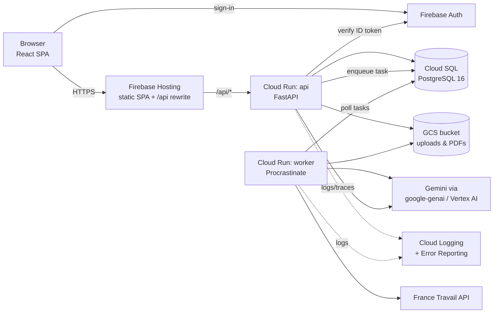

# RecruitAI: Target Architecture

**Status:** Proposal, v2 (product decisions resolved, see §8) · **Scope:** full system redesign done before any more feature work · **Focus:** individual job seekers first

This document looks at the current codebase, lists the problems that block it
from being production-grade, and defines the target architecture and stack.
Every later code change should follow it. If a decision here turns out wrong,
change this document first, then the code.

---

## 1. Decisions at a glance

| Concern | Today | Target | Why |
|---|---|---|---|
| Backend framework | FastAPI | **FastAPI** (kept) | Good fit already: async, Pydantic-native, generates OpenAPI |
| Backend structure | Layered by type (`api/`, `application/`, `domain/`, `infrastructure/`) spread across 60+ tiny folders | **Modular monolith, one folder per feature** (`modules/<feature>/`) | A feature's code lives in one place and is easy to find |
| Language / tooling | Python 3.13, uv, no linter | Python 3.13, **uv + ruff + mypy + pytest**, pre-commit | Consistent code, catches bugs before CI |
| Config | `os.getenv` scattered across modules, `load_dotenv()` at import time, gitignored YAML | **pydantic-settings**: one typed `Settings` object | One place, validated at startup |
| Database | SQLite files on local disk plus a hand-written migration runner | **PostgreSQL 16 + SQLAlchemy 2.0 (async) + Alembic** | Multi-instance safe, FKs, JSONB, real migrations |
| Background jobs | Polling thread + `ThreadPoolExecutor` inside the API process | **Procrastinate** (Postgres-backed queue) running as a **separate worker process** | Durable, retries, no extra infrastructure (reuses Postgres) |
| File storage | Local `db/` folders plus `/tmp` | **Object storage** (GCS in prod, local filesystem in dev) behind a `Storage` interface | Stateless containers; files survive restarts |
| Auth / tenancy | Tenant API keys in an env JSON; the key can also be passed in the query string | **Firebase Auth (Identity Platform)** for users, with **organizations + memberships + roles** in Postgres | Real users; the tenant comes from the token, never from the client |
| LLM access | LangChain wrappers around Gemini, with stateful agent objects | **`google-genai` SDK** behind a small **`LLMGateway`** interface; stateless calls with structured output | Fewer dependencies, native JSON schema output, cost tracking |
| PDF (letters) | `latexmk` via subprocess (TeX is not installed in the image, so it fails in Docker) | **Tectonic** (single-binary LaTeX engine) in the worker image | Keeps the LaTeX editing feature and actually works in a container |
| Frontend | Vanilla JS + Tailwind CDN, 1,300-line `index.html`, JS served by a catch-all route | **React + TypeScript + Vite**, TanStack Query, React Router, Tailwind (built), shadcn/ui | Components, types, a real build |
| API contract | Hand-written `fetch` calls | **Typed client generated from OpenAPI** (`openapi-typescript` + `openapi-fetch`) | The frontend breaks at compile time, not at runtime |
| Deploy | One container, service-account key file mounted | **Cloud Run** (api + worker), **Cloud SQL**, **GCS**, **Firebase Hosting**, **Secret Manager** | GCP-native (you already use Vertex AI); no key files |
| CI/CD | None | **GitHub Actions**: lint → typecheck → test → build → deploy | Nothing reaches `main` without passing checks |

---

## 2. Current state: problems found

These are the reasons for the redesign, with evidence from the code.

### 2.1 Architecture
1. **God object.** `backend/workers/background.py` (883 lines) is the job queue *and*
   the repository for candidates, jobs, fit analyses, and applications. Every
   feature depends on it.
2. **Duplicated, diverging code.** `infrastructure/jobs/providers/` and
   `infrastructure/jobs/search/providers/` are two copies of the same provider
   code that have drifted apart. `_sanitize_filename` and the upload-directory
   setup are copy-pasted into `api/cv.py`, `api/applications.py`, and
   `application/fit/service.py`.
3. **Business logic in routers.** `api/cv.py` (442 lines) and
   `api/applications.py` (333 lines) handle file I/O, persistence, and
   orchestration directly.
4. **Wildcard re-export shims.** `infrastructure/jobs/agent.py`, `prompt.py`,
   and `domain/jobs/schema.py` exist only to `import *` from other modules.
5. **Fake singletons.** The pattern `agent = None` / `global agent` in the
   routers never assigns the global, so a new agent is built on every request
   anyway. It's there as a test hook, but it misleads readers.

### 2.2 Data and state
6. **SQLite on local disk.** On Cloud Run each instance gets its own disk, and
   the disk is lost on restart. Two instances means two separate databases.
7. **State is scattered.** Some results go in SQLite, some are JSON files under
   `db/`, and fit results are written to `tempfile.gettempdir()` (lost on
   restart). The job-search cache is a *second* SQLite database.
8. **Schema.** No foreign keys, no indexes on `tenant_id`, timestamps stored as
   TEXT, JSON stored as TEXT. The migration runner is hand-written.

### 2.3 Security
9. **Weak tenancy.** Tenants authenticate with shared API keys from an env var.
   There are no users. The frontend defaults to `default-tenant`.
10. **Secrets in logs.** `get_tenant_context` accepts `api_key` as a **query
    parameter**, and the request middleware logs `str(request.url)`, so API
    keys end up in the logs.
11. **Service-account key file** is mounted into the container
    (`docker-compose.yaml`). The container runs as root.

### 2.4 Runtime and operations
12. **Queue inside the web process.** A polling thread plus a thread pool
    inside the API process competes with request handling. Its metrics are
    in-memory counters that reset on restart and are wrong with more than one
    instance.
13. **PDF generation cannot work in Docker.** `latexmk` is called by
    subprocess, but TeX is not installed in the image. The failure is logged
    and `None` is returned.
14. **Wrong dependencies** (`backend/pyproject.toml`):
    - `genai` is an unrelated PyPI package, not Google's `google-genai`.
    - `vertexai` is deprecated.
    - `dotenv` is not `python-dotenv`.
    - `path` is unused.
    - `pytest` is in runtime dependencies.
    - `pyyaml` is imported optionally but never declared.
15. **Config** relies on `config/agent_config.yaml`, which is gitignored, so a
    fresh clone behaves differently from the author's machine.

### 2.5 Frontend
16. One 1,300-line `index.html` plus about 3,000 lines of untyped JS modules.
    Tailwind comes from the CDN (the Tailwind docs say not to use it in
    production). JS is served by a FastAPI catch-all route (`/{filename}.js`).
    The API contract is duplicated by hand in `api.js`.

### 2.6 What is worth keeping
- **The prompts** (`infrastructure/*/prompt.py`). These are the product's core
  IP. Move them, don't rewrite them.
- **The Pydantic schemas** in `domain/*/schema.py`: CV, job, fit, HR, and
  letter models. They become the LLM output schemas.
- **The France Travail provider** logic (use the newer `search/providers` copy).
- **Structured JSON logging** with request/tenant correlation IDs.
- **The tests' intent**, especially `test_cross_tenant_isolation.py`. They get
  rewritten against the new structure.
- The UX flows: candidate wizard, recruiter hub, application tracker, letter
  co-writing preview.

---

## 3. Target system overview



**Principles**
1. **Stateless processes.** All state lives in Postgres or GCS, so any instance
   can serve any request.
2. **Tenant from the token, never from input.** `org_id` is resolved from the
   authenticated user and the active membership. Clients cannot choose it.
3. **Long work goes async.** Anything that can take more than about 10 s, or
   fans out (PDF compile, job search with an LLM, data export), becomes a
   task. The API returns `202` with a task id. Single-document extraction may
   stay synchronous.
4. **One module per feature.** Modules talk to each other only through their
   `service.py`, never through another module's repository or tables.
5. **The LLM is a dependency, not the architecture.** Business code calls
   `LLMGateway.generate(schema=..., prompt=...)`. Swapping models or providers
   is a one-file change.

---

## 4. Backend

### 4.1 Layout

```
backend/
├── pyproject.toml            # uv; ruff + mypy + pytest config
├── alembic.ini
├── alembic/                  # migrations
├── src/recruitai/
│   ├── main.py               # create_app(): routers, middleware, exception handlers
│   ├── worker.py             # Procrastinate app entrypoint
│   ├── config.py             # Settings (pydantic-settings)
│   ├── core/
│   │   ├── db.py             # async engine, session dependency, Base
│   │   ├── auth.py           # Firebase token verification → CurrentUser
│   │   ├── tenancy.py        # OrgContext dependency, role checks
│   │   ├── storage.py        # Storage protocol + GCS / local implementations
│   │   ├── errors.py         # AppError hierarchy → RFC 9457 problem+json
│   │   ├── logging.py        # JSON logs, request_id / org_id context
│   │   └── tasks.py          # Procrastinate app + task-status helpers
│   ├── ai/
│   │   ├── gateway.py        # LLMGateway protocol: generate(schema, messages) -> model
│   │   ├── gemini.py         # google-genai implementation (API key or Vertex)
│   │   ├── usage.py          # records tokens/latency/cost per org & feature
│   │   └── prompts/          # versioned prompt modules (moved from infrastructure/*)
│   └── modules/
│       ├── identity/         # users, organizations, memberships, invites
│       ├── documents/        # upload, type/size validation, text extraction (pdfplumber)
│       ├── candidates/       # CV → CandidateProfile extraction & CRUD
│       ├── jobs/             # job postings: manual/file extraction + external search
│       │   └── providers/    # JobProvider protocol, france_travail.py
│       ├── matching/         # fit analysis (v1); recruiter batch screening later
│       ├── letters/          # writing studio: structured letters, versions, templates → PDF (§10)
│       ├── privacy/          # data export, account deletion, retention sweeps (§11)
│       └── applications/     # application tracker + status history
└── tests/
    ├── unit/                 # services with fake repos / fake LLM
    ├── integration/          # API + real Postgres (testcontainers)
    └── evals/                # golden CV/JD pairs to score prompt quality (run on demand)
```

Each module has the same shape:

```
modules/<feature>/
├── router.py      # HTTP only: parse, call service, map result → response schema
├── service.py     # business logic; no FastAPI imports; takes OrgContext explicitly
├── repository.py  # SQLAlchemy queries; every query filters by org_id
├── models.py      # SQLAlchemy ORM tables
├── schemas.py     # Pydantic request/response DTOs + LLM output schemas
└── tasks.py       # Procrastinate tasks for this feature (optional)
```

**Dependency rules** (enforced in CI with `import-linter`):
- `router → service → repository`. Routers never touch the DB or LLM directly.
- `modules/*` may import `core/*` and `ai/*`. Neither of those imports `modules/*`.
- One module uses another only through its `service.py`.

### 4.2 API conventions
- Prefix every route with `/api/v1`. Routes are resource nouns
  (`/profile`, `/documents`, `/jobs`, `/fit-analyses`, `/letters`,
  `/applications`).
- Async operations: `POST /api/v1/letters/{id}/render` returns
  `202 {task_id, status_url}`, and clients poll `GET /api/v1/tasks/{id}`.
  Server-sent events can be added later.
- Errors use `application/problem+json` (RFC 9457) with a stable `code` field.
- List endpoints use cursor pagination (`?cursor=&limit=`).
- Uploads go to `POST /api/v1/documents` (multipart), which returns a
  `document_id`. Other endpoints then reference documents by id.
- Security limits: 10 MB max upload, an allowlist of MIME types checked by
  content (not only by extension), and the filename is never used as a
  storage path.

### 4.3 Data model (PostgreSQL)

Every tenant-owned table has `org_id UUID NOT NULL REFERENCES organizations`,
`created_at timestamptz`, and an index on `(org_id, created_at)`. Primary keys
are UUIDv7 (time-sortable).

| Table | Key columns | Notes |
|---|---|---|
| `organizations` | id, name, kind (`personal` \| `company`) | A candidate gets a personal org automatically at sign-up |
| `users` | id, firebase_uid, email, display_name, last_active_at, deletion_warned_at | |
| `memberships` | org_id, user_id, role (`owner` \| `recruiter` \| `member`) | Unique on (org_id, user_id) |
| `documents` | id, org_id, kind (`cv` \| `jd` \| `letter_pdf` \| `attachment`), storage_key, mime, size, sha256, uploaded_by | The file bytes live in GCS |
| `candidate_profiles` | id, org_id, document_id, name, email, data JSONB, schema_version | `data` holds `CVInformation` |
| `job_postings` | id, org_id, source (`manual` \| `file` \| `france_travail`), external_id, title, company, data JSONB | Unique on (org_id, source, external_id) |
| `fit_analyses` | id, org_id, candidate_id, job_id, score, verdict, data JSONB, model, prompt_version | |
| `screenings`, `screening_results` | *(later, B2B module)* | Not built in v1 |
| `letters` | id, org_id, candidate_id, job_id, kind, template, content JSONB, latex_override, language, tone, length, status (`draft` \| `final`) | See §10.3 |
| `letter_versions` | letter_id, n, content JSONB, created_at | Version history |
| `applications` | id, org_id, job_id NULL, company_name, source, status, applied_at, notes | |
| `application_events` | id, application_id, from_status, to_status, at, note | Status history for the tracker timeline |
| `job_search_cache` | key, provider, payload JSONB, expires_at | Replaces the second SQLite DB |
| `ai_calls` | id, org_id, feature, model, prompt_version, input_tokens, output_tokens, latency_ms, status | Usage and cost dashboard, quotas later |
| `procrastinate_*` | managed by the library | Task queue |

Later hardening: Postgres **Row-Level Security** on `org_id` as a second line of
defence behind the repository filters.

### 4.4 Auth and multi-tenancy
1. The frontend signs in with Firebase Auth (Google + email/password) and sends
   `Authorization: Bearer <ID token>`.
2. `core/auth.py` verifies the token (with `firebase-admin`, public keys
   cached) and upserts the `users` row, giving a `CurrentUser`.
3. The client sends `X-Org-Id` to pick the active org. `core/tenancy.py`
   checks the membership and returns `OrgContext(org_id, user_id, role)`. If
   the user is not a member, the request gets `404` (not `403`, so the org's
   existence isn't revealed).
4. Routes declare what they need, for example
   `ctx: OrgContext = Depends(require_role("recruiter"))`.
5. **Deleted:** tenant API keys in env vars, and credentials in query strings.
   Machine-to-machine API keys can come back later as a hashed `api_keys` table
   if needed.

### 4.5 AI layer
- `LLMGateway.generate(*, schema: type[T], system: str, user: str | list[Part], feature: str) -> T`
  uses Gemini **structured output** (`response_schema`), so there's no manual
  JSON parsing. PDFs and images can be passed as native parts, which may let
  some CVs skip text extraction.
- Every call is **stateless**. Agents no longer keep `conversation_history`. The
  only multi-turn flow (job search with tool calls) keeps its message list
  local to the task.
- Every call records to `ai_calls` with token counts, latency, model, and
  `prompt_version`.
- Retries with exponential backoff on 429 and 5xx. Per-call timeout.
  Per-org concurrency limit in the worker.
- **Prompt injection:** CV and JD text is untrusted. Wrap it in delimiters,
  tell the model to treat it as data, and validate outputs against the schema.
  The model gets no tools that write data.
- Models are set in `Settings` (`LLM_MODEL_FAST`, `LLM_MODEL_SMART`), not
  hard-coded.
- `tests/evals/` holds a small golden set (about 20 CV/JD pairs with expected
  score bands). Run it before changing a prompt or a model.

### 4.6 Background tasks
- **Procrastinate** tasks are defined per module in `tasks.py`, for example
  `letters.render_pdf`, `jobs.search_external`, `privacy.export_user_data`, `privacy.retention_sweep`.
- The worker runs as a separate process (`procrastinate worker`), deployed as
  its own Cloud Run service with CPU always allocated and min instances = 1.
- The task is enqueued **in the same DB transaction** as the row that tracks
  it, so a task is never lost and never orphaned.
- Retries: 3 attempts with exponential backoff. A task that fails for good
  marks its domain row `failed` with an error code that is safe to show users.
- Task status goes through `GET /api/v1/tasks/{id}`, which reads the domain
  row, not the queue internals.

### 4.7 Documents and PDFs
- `Storage` protocol with `put`, `get`, `signed_url`, and `delete`.
  `GCSStorage` in prod, `LocalStorage` in dev and tests.
- Object keys: `orgs/{org_id}/{kind}/{document_id}`. Never derived from the
  user's filename.
- Downloads go through short-lived **signed URLs** after an authorization check.
- Letter PDFs: the worker renders the LaTeX template, compiles it with
  **Tectonic**, stores the PDF in GCS, and links it to `letters.pdf_document_id`.
  Drafts are regular `letters` rows with `status='draft'`. A GCS lifecycle rule
  deletes drafts after 7 days.

### 4.8 Cross-cutting
- **Config:** a single `Settings(BaseSettings)` with an `.env` file only in
  dev. Secrets come from Secret Manager in prod. The app fails fast at startup
  if config is invalid.
- **Logging:** JSON logs to stdout with `request_id`, `org_id`, `user_id`, and
  `task_id`. No file handlers; Cloud Logging collects stdout. Only the URL
  path is logged, never the query string.
- **Errors:** domain code raises `AppError` subclasses (`NotFound`,
  `Forbidden`, `ValidationFailed`, `UpstreamUnavailable`). One handler maps
  them to problem+json. Unhandled errors return a generic 500 and go to Error
  Reporting.
- **Testing:**
  - Unit tests use fake repositories and a fake `LLMGateway`.
  - Integration tests run against real Postgres via testcontainers.
  - One cross-tenant test per module (org A must never see org B's data).
  - Coverage target is ≥ 80% on `services`.
- **Quality gates:** `ruff check`, `ruff format --check`, `mypy --strict` on
  `src/`, `import-linter`, and `pytest`.

---

## 5. Frontend

```
frontend/
├── package.json            # pnpm
├── vite.config.ts
├── src/
│   ├── main.tsx
│   ├── app/                # router, providers (QueryClient, Auth), layout shell
│   ├── lib/
│   │   ├── api/            # generated schema.d.ts + openapi-fetch client + auth header
│   │   ├── auth.ts         # Firebase Auth wrapper
│   │   └── utils.ts
│   ├── components/ui/      # shadcn/ui primitives
│   └── features/
│       ├── candidate/      # upload CV, pick job, fit report, interview kit
│       ├── settings/       # account, privacy: export / delete
│       ├── (recruiter/)    # later: B2B module
│       ├── letters/        # split-screen editor + PDF preview
│       ├── tracker/        # applications board/table + timeline
│       └── job-search/     # France Travail search
└── tests/                  # Vitest + Testing Library; Playwright for e2e smoke
```

- **Stack:** React 19, TypeScript (strict), Vite, React Router, TanStack Query
  (server state and polling of async tasks), react-hook-form + zod (forms),
  Tailwind CSS v4 (built), shadcn/ui, and react-pdf for previews.
- **API types** are generated by `pnpm gen:api` from FastAPI's `/openapi.json`.
  CI fails if the generated file is out of date.
- **Why not Next.js:** the app sits behind a login, has no SEO needs, and is
  already served by a Python API. A static SPA is simpler and cheaper to host.
- **Hosting:** Firebase Hosting serves the built SPA and rewrites `/api/**` to
  the Cloud Run API, so everything is same-origin and needs no CORS setup.
  FastAPI stops serving HTML and JS.

---

## 6. Environments and delivery

| | Local dev | Production |
|---|---|---|
| API | `uv run fastapi dev` | Cloud Run `recruitai-api` |
| Worker | `uv run procrastinate worker` | Cloud Run `recruitai-worker` (always-on CPU) |
| DB | Postgres in `docker compose` | Cloud SQL Postgres 16 (private IP, automated backups) |
| Files | `LocalStorage` (`./.data`) | GCS bucket (uniform access, lifecycle rules) |
| Auth | Firebase Auth emulator | Firebase Auth / Identity Platform |
| LLM | Gemini API key | Vertex AI via the service's workload identity (no key files) |
| Frontend | `pnpm dev` (Vite proxy `/api` → :8000) | Firebase Hosting |
| Secrets | `.env` (gitignored) | Secret Manager |

- **Docker:** multi-stage build using the official `ghcr.io/astral-sh/uv`
  image. Runs as a non-root user. The API image and the worker image are
  separate; only the worker needs Tectonic. No Rust toolchain.
- **CI (GitHub Actions) on every PR:**
  - backend: `ruff`, `mypy`, `import-linter`, `pytest` (with a Postgres service)
  - frontend: `tsc`, `eslint`, `vitest`, `build`
  - an OpenAPI drift check
- **CD on merge to `main`:**
  1. Build images and push to Artifact Registry.
  2. Run `alembic upgrade head` as a Cloud Run job.
  3. Deploy the API and the worker.
  4. Deploy the frontend.
- **Branching:** short-lived feature branches merged into `main` through PRs.
  Retire the long-lived `develop` / `dev-frontend` branches.

---

## 7. Migration plan

**Rebuild in place, feature by feature. No from-scratch rewrite.** The prompts
and schemas carry over. Everything around them is replaced. Each phase ends
with a green CI run and a working app.

| Phase | Work | Exit criteria |
|---|---|---|
| **0. Foundations** | New `backend/src/recruitai` skeleton, `Settings`, fixed `pyproject.toml` (remove `genai` / `vertexai` / `dotenv` / `path`; add `google-genai`, `sqlalchemy[asyncio]`, `asyncpg`, `alembic`, `procrastinate`, `pydantic-settings`, `firebase-admin`, `google-cloud-storage`; move pytest to a dev group), ruff, mypy, pre-commit, GitHub Actions, `docker compose` with Postgres | `create_app()` boots, `/health` is green, CI runs |
| **1. Core platform** | `core/db` + first Alembic migration (identity tables), Firebase auth + `OrgContext`, `Storage`, error handling, logging, `LLMGateway` + `ai_calls`, Procrastinate worker + `/tasks/{id}` | Sign in, create an org, upload a file, run a dummy task end to end, with tests |
| **2. Port features (B2C)** | In order: `documents` + `candidates` (Master profile) → `jobs` (job inbox, France Travail, cache table) → `matching` (fit only) → `letters` (studio v1, §10) → `applications` (tracker) → `privacy` (export/delete/sweeps, §11). Each one moves its prompts and schemas and gets a cross-tenant test | The whole v1 individual journey (§8.1) works end to end through `/api/v1` with tests |
| **3. Frontend rebuild** | Vite/React app, auth, generated client. Screens in the same order as phase 2 | Feature parity with the current UI |
| **4. Production** | GCP project in an EU region with Terraform (§9): Cloud SQL, GCS + lifecycle rules, Secret Manager, Cloud Run ×2, Firebase Hosting + Auth + App Check, Cloud Scheduler, budget alerts. CD pipeline, alerts on 5xx rate and task failures. Privacy policy page | Deployed from `main` with no manual steps |
| **6. Later: recruiter (B2B)** | Company orgs + `recruiter` role, screenings, outreach. Check EU AI Act high-risk obligations first (§8.1) | — |
| **5. Cleanup** | Delete `api/`, `application/`, `domain/`, `infrastructure/`, `workers/`, `migrations/`, old `frontend/*.js`, and the old Dockerfile | Only the new structure remains |

Existing SQLite data is dev-only, so no data migration is planned. If some of
it must be kept, a one-off import script can go in phase 2.

---

## 8. Product decisions (resolved)

| # | Question | Decision |
|---|---|---|
| 1 | Primary customer | **Individual job seekers (B2C) first.** Recruiter features (bulk screening, outreach) are postponed to a later phase |
| 2 | Auth / platform | **Google-native end to end:** Firebase Auth → upgrade to Identity Platform when needed, Cloud Run, Cloud SQL, GCS, Vertex AI, all in an **EU region** |
| 3 | Letters | Keep LaTeX as the rendering engine, but make letters a **structured, multi-format writing studio** (§10) |
| 4 | Data retention | A **privacy-first retention policy** based on GDPR / CNIL practice and how comparable products work (§11) |

### 8.1 What "individual first" changes

- **Tenancy stays, but users don't see it.** Every user gets a `personal`
  organization at sign-up, and every row still carries `org_id`. The UI never
  shows organizations. Company orgs and recruiter roles can be added later
  without a data migration.
- **`memberships.role`** starts with only `owner`. `recruiter` is added when
  the B2B module ships.
- **Scope for v1:** the `matching` module does fit analysis only. The
  `screenings` / `screening_results` tables and the `features/recruiter` UI are
  **not built** in v1. The old `/api/hr/*` endpoints are not ported. Their
  prompts are archived under `ai/prompts/_archive/` for later use.
- **A regulatory reason to wait on recruiter features:** the EU AI Act lists AI
  used by employers to *filter, rank or evaluate candidates* as **high-risk**
  (Annex III). That brings risk management, logging, human oversight, and
  conformity duties. A tool a job seeker uses on their *own* documents is not
  in that category. Check the current enforcement dates before building the
  B2B module; the high-risk timeline was under revision in 2025–26.

**v1 journey for an individual user** (this sets the build order):

```
Sign in with Google
  → Build "Master profile" (upload CV once → structured, editable profile)
  → Collect jobs (paste JD text/URL, upload file, or search France Travail) → "Job inbox"
  → For a job: Fit report (score, strengths, gaps, advice)
  → Generate application kit: tailored letter (§10) + interview prep
  → Track the application (tracker board + status timeline + reminders)
```

## 9. Auth and deployment on Google Cloud

**Auth: Firebase Authentication**
- Sign-in methods: **Google** (one click, likely the main path), plus
  **email + password with email verification**. Magic link can come later.
- Upgrade to **Identity Platform** (same SDK, one-click upgrade in the
  console) only when you need MFA, blocking functions (for example, to reject
  disposable emails), or an SLA.
- The backend verifies ID tokens with `firebase-admin`. There is no password
  storage anywhere in our code.
- **Firebase App Check** (reCAPTCHA Enterprise) protects the AI endpoints from
  scripted abuse, since each call costs money.
- Local dev uses the **Firebase Local Emulator Suite**, so no real accounts are
  needed in tests.

**Google Cloud services**

| Need | Service | Notes |
|---|---|---|
| API + worker | **Cloud Run** (`europe-west1` or `europe-west9` Paris) | Scale to zero for the API; the worker runs with min 1 instance |
| Database | **Cloud SQL for PostgreSQL 16** | Smallest shared-core tier for the MVP; this is the main fixed monthly cost |
| Files | **Cloud Storage** (same region) | Lifecycle rules enforce retention (§11) |
| LLM | **Vertex AI Gemini** (EU region) | Use **Vertex, not the free AI Studio tier**, for user data. See §11.4 |
| Secrets | **Secret Manager** | France Travail credentials and similar |
| Frontend | **Firebase Hosting** | Global CDN; `/api/**` rewrites to Cloud Run |
| Scheduled jobs | **Cloud Scheduler → Cloud Run jobs** | Retention sweeps, reminder emails |
| Email | Firebase Auth for auth emails; transactional email (reminders) through a provider such as Brevo or SendGrid | GCP has no native email-sending service |
| Observability | Cloud Logging, Error Reporting, Cloud Monitoring alerts | Plus **budget alerts** on the billing account from day one |
| IaC | **Terraform** (`infra/`) | Added in phase 4, so the environment can be rebuilt |

Service accounts use **workload identity**: Cloud Run runs as a dedicated
service account with least-privilege roles (`roles/aiplatform.user`,
`roles/cloudsql.client`, bucket-scoped `roles/storage.objectAdmin`). No JSON
key files exist anywhere.

## 10. Letters: writing studio

The goal is to go from "generate one letter" to a studio that covers every
format a job seeker actually has to write.

### 10.1 Model: structured content, rendered by templates
- A letter is stored as **structured blocks** (`header`, `recipient`,
  `subject`, `salutation`, `opening`, `body[]`, `closing`, `signature`) in
  `letters.content JSONB`. It is not stored as raw LaTeX.
- **Templates** are Jinja-rendered LaTeX files (`letters/templates/*.tex.j2`),
  compiled by Tectonic in the worker. Changing the template never needs the
  AI to run again.
- **Advanced mode:** a user can "eject" to raw LaTeX (the current co-writing
  feature). Ejected letters store `latex_override` and skip templating.

### 10.2 Features (v1 → later)

| Feature | What it does | Phase |
|---|---|---|
| **Templates** | Classic, Modern, Compact, and a **French "lettre de motivation"** layout (sender/recipient blocks, *Objet :*, *formule de politesse*) | v1 |
| **Languages & tones** | FR / EN first (current); tones: professional, warm, confident, academic, formal. Length: short / standard / detailed | v1 |
| **Paragraph-level regenerate** | Regenerate or edit one block without touching the rest | v1 |
| **Inline AI actions** | Select text → *shorten, more formal, more concrete, add a metric, fix grammar* | v1 |
| **Grounding check** | Every claim is checked against the Master profile. Unsupported claims are highlighted so the AI can't invent experience | v1 |
| **Quality panel** | JD keyword coverage, length, clichés detected, readability, repeated words | v1 |
| **Versions** | Autosave versions, compare two versions, restore | v1 |
| **Multi-format outputs** from one letter | PDF, **DOCX**, plain text for web forms, **email-body version**, **LinkedIn / recruiter message** (≤300 chars), and a **follow-up email** after applying | v1 (PDF, text, email) / v2 (DOCX, LinkedIn, follow-up) |
| **Company personalization** | The user pastes notes about the company (or later a URL fetch), and the "why this company" paragraph uses them | v2 |
| **Snippet library** | Save reusable paragraphs (for example "my career change story") and insert them into any letter | v2 |
| **Other letter types** | Spontaneous application, internship/alternance, thank-you after interview, offer acceptance/decline | v2 |

### 10.3 Data
`letters` gains:
- `kind` (`cover` \| `spontaneous` \| `follow_up` \| `thank_you` …)
- `template`, `content JSONB`, `latex_override`
- `language`, `tone`, `length`
- `status` (`draft` \| `final`)

A new `letter_versions (letter_id, n, content, created_at)` table holds the
version history. Rendered outputs are `documents` rows (`kind='letter_pdf'` /
`'letter_docx'`), so they follow the retention rules below.

## 11. Data and privacy: market practice → our policy

*This is product guidance, not legal advice. Have the privacy policy reviewed
before public launch.*

### 11.1 What the market does
- **Consumer career tools** (resume builders, job trackers, cover-letter
  generators, e.g. Teal, Huntr, Kickresume, Jobscan) usually:
  - keep data **for as long as the account exists**
  - offer **self-service delete account** and **data export**
  - delete **inactive accounts** after a stated period
  - say in their policies whether user content is used to train AI
  
  Users increasingly check that last point.
- **Recruiters in France (CNIL guidance)** keep an unsuccessful candidate's
  data **at most 2 years after last contact**, unless the candidate agrees to
  longer. This matters for the future B2B module, not for v1.
- **CNIL on inactive accounts:** delete or anonymize data after a defined
  inactivity period, and warn the user before doing it.
- **CVs often contain personal data beyond what's needed:** photos, birth
  dates, nationality, sometimes health or religion (special-category data under
  GDPR Art. 9). Good practice is **data minimization**. Don't extract or keep
  fields the product doesn't use.

### 11.2 Our retention policy

| Data | Kept for | How it's enforced |
|---|---|---|
| Account, Master profile, jobs, letters, applications | While the account is active | — |
| **Inactive account** (no sign-in) | **Deleted after 24 months**, with warning emails at 30 and 7 days | Monthly Cloud Scheduler job |
| Uploaded original files (CV, JD) | While the account is active; the user can delete any file at any time | Deleting a file removes it from GCS; the extracted profile stays unless also deleted |
| Letter **drafts** / temporary previews | **7 days** | GCS lifecycle rule on the `tmp/` prefix + DB sweep |
| Guest / not-signed-in trial uploads (if we add a trial) | **24 hours** | GCS lifecycle rule |
| Job search cache (public job ads) | 24 hours | `expires_at` + sweep |
| `ai_calls` usage records | 13 months, **metadata only**: tokens, model, latency. Never prompt or CV content | Sweep job |
| Application logs | 30 days (Cloud Logging default). **Never log CV/letter content or emails** | Logging filter + code review rule |
| Database backups | 7 days (Cloud SQL automated backups + PITR) | Deleted data is gone from backups within 7 days |
| **Account deletion** | Hard delete of DB rows and GCS objects **immediately**; backups age out within 7 days | `DELETE /api/v1/me`, which runs a worker task |

### 11.3 User rights built into the product (v1)
- **Export my data** (GDPR Art. 20): a ZIP with JSON (profile, jobs, letters,
  applications) plus the original files. Built by a worker task and delivered
  as a signed URL that expires in 24 h.
- **Delete my account**, and delete individual files or letters, from Settings.
- **Minimization at extraction:** the CV schema does **not** keep photo, date
  of birth, gender, nationality, or marital status, even if they're in the CV.
  An optional "privacy check" warns the user when their CV includes them. In
  France these are best left out of a CV anyway.
- **Consent and transparency:** a clear privacy notice at sign-up saying data
  is processed in the EU by Google Cloud as processor, and that **user content
  is never used to train AI models**.

### 11.4 AI and data location
- Use **Vertex AI** in an EU region. Google's Vertex terms state that customer
  data isn't used to train its models. The **free Gemini API (AI Studio) tier
  may use inputs to improve Google products**, so it must never receive real
  user CVs. Keep API-key mode for local development with fake data only.
- Keep Cloud SQL, GCS, Cloud Run, and Vertex in the **same EU region**, so data
  stays in the EU and cross-region egress costs are avoided.
- Paperwork to put in place: Google Cloud's Data Processing Addendum (accept
  it in the console), a short **record of processing activities**, and a
  privacy policy page.

## 12. Architecture decision records

When a decision in this document changes, add a short ADR to `adr/NNNN-title.md`
(context → decision → consequences). The initial set is the rows in §1 and §8.
