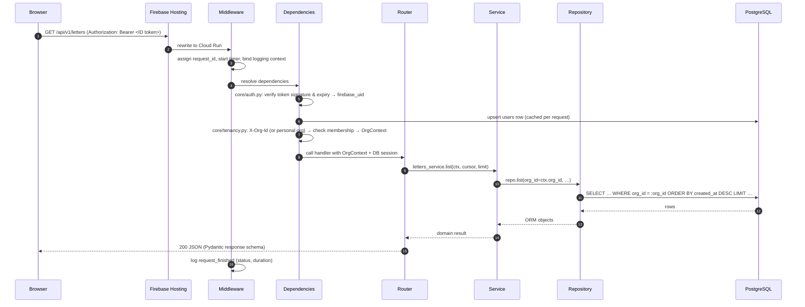
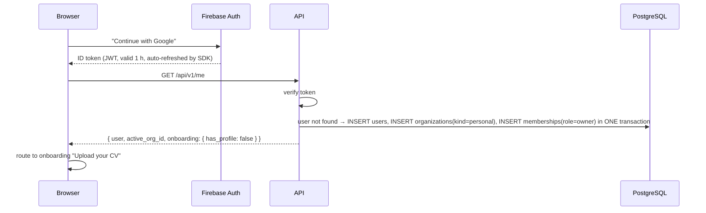
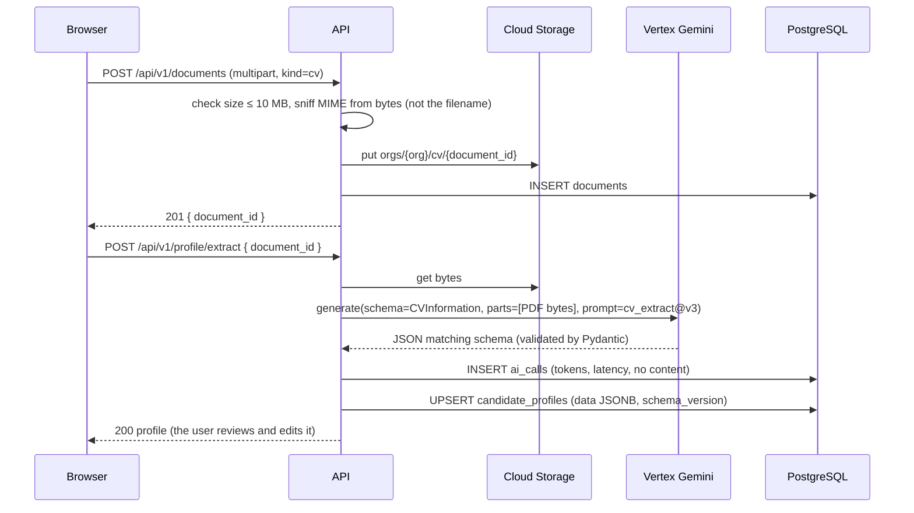

# 01 · System Walkthrough

This document follows real user actions through the system, component by
component. Once you've read it, you should be able to point to where any piece
of behavior lives.

---

## 1. The components and what each one owns

| Component | Runs where | Owns | Must never |
|---|---|---|---|
| **Web app** (React SPA) | User's browser, served by Firebase Hosting | Screens, forms, client-side validation, showing task progress | Hold secrets, decide permissions, call Gemini directly |
| **Firebase Auth** | Google-managed | Passwords, Google sign-in, email verification, issuing ID tokens | Store app data (profiles, letters, …) |
| **API** (FastAPI) | Cloud Run service `recruitai-api` | HTTP endpoints, auth checks, business rules, short AI calls, enqueueing tasks | Keep anything in memory or on local disk between requests |
| **Worker** (Procrastinate) | Cloud Run `recruitai-worker` | Long or retryable work: PDF rendering, data export, deletions, retention sweeps, external job search | Serve user HTTP traffic |
| **PostgreSQL** | Cloud SQL | All structured data **and** the task queue tables | Store large files (CV PDFs go to GCS) |
| **Cloud Storage** | GCS bucket | Original uploads, rendered PDFs/DOCX, export ZIPs | Be publicly readable (access is only through signed URLs) |
| **Vertex AI Gemini** | Google-managed | Extraction, analysis, writing | Receive data it doesn't need (see minimization in ARCHITECTURE §11) |
| **France Travail API** | External | Public job offers | Be called on every page load (results are cached for 24 h) |

The API and the worker are **the same Python codebase** with two entrypoints
(`main.py` and `worker.py`). They share modules, models and services, so
business logic is never duplicated.

---

## 2. Anatomy of one API request

Every authenticated request goes through the same pipeline.



**What each layer is allowed to know**

| Layer | Knows about | Doesn't know about |
|---|---|---|
| Router | HTTP: status codes, headers, request/response schemas | SQL, Gemini, GCS |
| Service | Business rules, other modules' services, `LLMGateway`, `Storage`, task enqueueing | HTTP, FastAPI |
| Repository | SQLAlchemy, tables of its own module | Anything outside its module's tables |
| `core/*` | Cross-cutting infrastructure (DB session, auth, storage, errors, logging) | Any specific feature |
| `ai/*` | Talking to Gemini, prompts, usage recording | Any HTTP or DB detail of features |

**Why this matters to you:** when a bug appears, its type tells you which
layer to look in. A wrong status code is the router. A wrong business result
is the service. Missing or leaked data is the repository. A token problem is
`core/auth.py`.

---

## 3. Flow A: sign up and first visit



Key points:
- **Lazy provisioning:** the database user is created on the first
  authenticated request. No separate sign-up endpoint and no Firebase webhook
  are needed.
- The user, the personal org and the membership are created **in one
  transaction**, so a user can never exist without an org.

---

## 4. Flow B: upload CV → Master profile



Design choices you can see here:
- **Upload and extraction are two separate calls.** An upload that works but
  an extraction that fails doesn't lose the file. The user can press "retry
  extraction".
- **Synchronous extraction** is acceptable because one CV takes a few seconds.
  If p95 latency goes above about 10 s, move it to the worker. The frontend
  already polls tasks elsewhere, so the change stays small.
- **Minimization happens at the schema level:** `CVInformation` has no fields
  for photo, birth date or nationality, so they can't be stored even if
  Gemini sees them.

---

## 5. Flow C: fit report, letter, PDF (the async pattern)

```mermaid
sequenceDiagram
    participant B as Browser
    participant API
    participant DB as PostgreSQL (data + queue)
    participant W as Worker
    participant AI as Vertex Gemini
    participant GCS as Cloud Storage

    B->>API: POST /api/v1/fit-analyses { job_id }
    API->>AI: fit prompt (profile + job)
    API->>DB: INSERT fit_analyses
    API-->>B: 201 fit report

    B->>API: POST /api/v1/letters { job_id, template, tone, language }
    API->>AI: generate(schema=LetterContent)
    API->>DB: INSERT letters(status=draft) + letter_versions(n=1)
    API-->>B: 201 letter (structured blocks, editable)

    B->>API: POST /api/v1/letters/{id}/render { format: pdf }
    API->>DB: BEGIN; UPDATE letters SET render_status='queued'; INSERT procrastinate_jobs; COMMIT
    API-->>B: 202 { task_id, status_url }
    W->>DB: LISTEN/NOTIFY wakes worker, locks job
    W->>W: Jinja template → .tex → Tectonic → PDF
    W->>GCS: put orgs/{org}/letter_pdf/{doc_id}
    W->>DB: INSERT documents; UPDATE letters SET pdf_document_id, render_status='done'
    B->>API: GET /api/v1/tasks/{task_id}  (polled by TanStack Query every 1–2 s)
    API-->>B: { status: done, result: { download_url (signed, 15 min) } }
```

**The key property:** the business row update and the job insert happen in
**the same transaction**. Either both happen or neither does. There's no
"letter says queued but no job exists" state. This is the main reason the
queue lives in Postgres ([ADR 0005](decisions/0005-task-queue-procrastinate.md)).

**When a task fails:** Procrastinate retries it (3 attempts, exponential
backoff). After the last failure, the handler sets
`render_status='failed', error_code='latex_compile_error'`. The UI shows a
readable message plus a "Try again" button.

---

## 6. Where to change what

| I want to… | Go to |
|---|---|
| Add a field to the CV profile | `ai/prompts/cv_extract.py` (prompt) + `modules/candidates/schemas.py` (`CVInformation`) + bump `schema_version`. No DB migration is needed because the profile is stored as JSONB |
| Add a new column that I filter or sort on | `modules/<m>/models.py` + `alembic revision --autogenerate` + review the migration |
| Change how the fit score is computed | `ai/prompts/fit.py` + `modules/matching/service.py`; run `tests/evals` before and after |
| Add a letter template | `modules/letters/templates/<name>.tex.j2` + register it in `modules/letters/templates/__init__.py` |
| Change who can do something | `core/tenancy.py` (`require_role`) + the route's dependency |
| Add a scheduled cleanup | `modules/privacy/tasks.py` (periodic task) |
| Change the LLM model | `Settings.LLM_MODEL_FAST / LLM_MODEL_SMART` (env var). No code change |
| Add a new external job source | `modules/jobs/providers/<name>.py` implementing the `JobProvider` protocol |
| Add a screen | `frontend/src/features/<feature>/`; run `pnpm gen:api` if the API changed |

---

## 7. Invariants (things that are always true)

These are enforced by tests, types, or CI. If you find a case where one is not
true, that's a bug.

1. Every row in a tenant-owned table has a non-null `org_id` that references
   `organizations`.
2. Every repository method takes `org_id` as a required argument.
   (`test_cross_tenant_*` in each module proves it.)
3. No file path on disk or in GCS is built from user input. Keys are
   `orgs/{uuid}/{kind}/{uuid}`.
4. No CV text, letter text, token, or email address appears in logs.
5. Every AI call produces exactly one `ai_calls` row.
6. The API process never runs Tectonic, and never sleeps or polls.
7. Every schema change goes through an Alembic migration that is committed
   to git.
8. The frontend API types are regenerated from the backend's OpenAPI schema.
   CI fails on drift.
