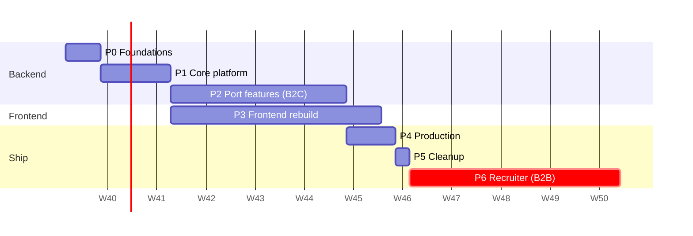

# 02 · Rebuild Phases: Strengths, Weaknesses, Risks

This expands the plan in ARCHITECTURE.md §7. For every phase it covers:

- **Goal**
- **Why it comes at this point**
- **Deliverables**
- **Strengths**
- **Weaknesses and risks**, with mitigations
- **Exit criteria**
- **Effort**

Effort figures are rough estimates for **one developer working full time with
AI assistance**. Double them if you work part time. They're a way to plan,
not a promise.

---

## Overview

| Phase | Effort | Can run in parallel with | Shippable result |
|---|---|---|---|
| P0 Foundations | 3–5 days | — | Empty app that boots, CI is green |
| P1 Core platform | 1.5–2 weeks | — | Log in, upload a file, run a task end to end |
| P2 Port features | 4–6 weeks | P3 (screen by screen) | Full v1 journey through the API |
| P3 Frontend | 4–6 weeks | P2 | Full v1 journey in the new UI |
| P4 Production | 1 week | — | Live on GCP, deployed from `main` |
| P5 Cleanup | 1–2 days | — | Old code deleted |
| P6 Recruiter (B2B) | later | — | Separate project |

**Total to a production v1: roughly 2.5–4 months** full time. The largest
uncertainty is P3, and it depends on how many studio features go into v1.

---

## Phase 0: Foundations

**Goal:** a new, empty, professionally tooled skeleton that every later line
of code is built on.

**Why first:** all later phases depend on the tooling (lint, types, tests,
CI). Adding it later means fixing hundreds of violations at once.

**Deliverables**
- `backend/src/recruitai/` with `main.py` (`create_app()`), `config.py`
  (`Settings`), and `/health`
- A clean `pyproject.toml`:
  - remove `genai`, `vertexai`, `dotenv`, `path`, `langchain*`
  - add `google-genai`, `sqlalchemy[asyncio]`, `asyncpg`, `alembic`,
    `procrastinate`, `pydantic-settings`, `firebase-admin`,
    `google-cloud-storage`, `jinja2`
  - dev group: `pytest`, `pytest-asyncio`, `testcontainers`, `ruff`, `mypy`,
    `import-linter`
- `ruff`, `mypy`, `import-linter` configs; `.pre-commit-config.yaml`
- `docker-compose.yaml` for dev: Postgres 16 + Firebase emulator (+ the API
  in watch mode)
- `.github/workflows/ci.yml`: lint, typecheck, tests with a Postgres service
- A `CLAUDE.md` that points to this handbook, so AI tools follow the rules

| Strengths | Weaknesses / risks | Mitigation |
|---|---|---|
| Very low risk; nothing user-facing changes | Nothing to demo at the end, so it feels like no progress | Keep it strictly timeboxed (≤ 1 week) |
| From day one, every change is checked automatically | Strict mypy can slow early work | `strict` on `src/` only; the old code is excluded |
| Dependency cleanup removes known wrong packages | Removing LangChain breaks the **old** code if both share the environment | The old code keeps running from the old lockfile, or is frozen; the new package gets its own dependency list |

**Exit criteria:** `docker compose up`, then `curl /health` returns 200. CI
is green on a PR. `uv run pytest` passes (with trivial tests).

---

## Phase 1: Core platform

**Goal:** all the cross-cutting infrastructure, proven end to end with one
dummy feature.

**Why here:** every feature needs the DB session, auth, tenancy, storage,
errors, the AI gateway and tasks. Building them **once, before features**
stops each feature from inventing its own version, which is exactly what
happened in the current code (three `_sanitize_filename`, two upload-dir
setups).

**Deliverables**
- `core/db.py` + the first Alembic migration: `organizations`, `users`,
  `memberships`, `documents`, `ai_calls`
- `core/auth.py` (Firebase token verification), `core/tenancy.py`
  (`OrgContext`, lazy provisioning of the personal org)
- `core/storage.py` (`LocalStorage` + `GCSStorage`), `core/errors.py`
  (problem+json), `core/logging.py` (JSON, no query strings, no PII)
- `ai/gateway.py` + `ai/gemini.py` + `FakeLLMGateway` for tests
- `core/tasks.py` (Procrastinate app), `worker.py`, `GET /api/v1/tasks/{id}`
- `modules/documents`: upload → GCS/local → `documents` row
- Tests: auth (emulator), cross-tenant isolation on documents, the task
  lifecycle

| Strengths | Weaknesses / risks | Mitigation |
|---|---|---|
| The highest-risk technical pieces (auth, tenancy, async tasks) are proven early, while they're still cheap to change | The most **abstract** phase: easy to over-engineer ("what if we need…") | Build only what the v1 journey needs. Every abstraction must have 2 real uses or a test double |
| Security properties (tenant isolation, no secrets in logs) are designed in, not added later | Firebase emulator, testcontainers and Procrastinate are three new tools to learn at once | Follow one working example per tool; keep the CI setup identical to local |
| Async SQLAlchemy is set up correctly once | Async SQLAlchemy has pitfalls (lazy loading raises errors in async) | Rule: use `selectinload` explicitly and never rely on lazy loading; this is in the review checklist |

**Exit criteria:**
- A user signs in (emulator) and `/me` returns their personal org.
- They upload a file, then download it through a signed URL.
- A dummy task goes queued → done and the UI can poll it.
- The cross-tenant test is green.

---

## Phase 2: Port features (B2C)

**Goal:** move each feature onto the new platform, in the order of the user
journey:
1. documents + candidates (Master profile)
2. jobs (inbox, France Travail, cache)
3. matching (fit only)
4. letters (studio v1)
5. applications (tracker)
6. privacy (export, delete, sweeps)

**Why this order:** each step uses the previous one's output
(profile → job → fit → letter → application). At any point, the ported part
is a usable product slice. Privacy comes last *in this phase*, but it's
**required before launch**.

**For each feature**, the same checklist:
1. Move its prompt to `ai/prompts/` with a version, and its schema to
   `schemas.py`.
2. Models + migration → repository → service → router.
3. Tests: unit (fake LLM), integration (real Postgres), cross-tenant, one eval
   case.
4. Tick it off in the tracking table: old endpoint → new endpoint → tested.

| Strengths | Weaknesses / risks | Mitigation |
|---|---|---|
| The prompts and schemas (the real product value) are reused, so this is mostly re-plumbing | **Scope creep:** "while I'm here, let me add…" is the most likely way this phase runs over | Porting and new features go in separate PRs. The letter studio v1 feature list (§10.2) is fixed before starting |
| Each feature gets tests and a cross-tenant check, which the old code mostly didn't have | Prompts written for LangChain message formats may behave differently through the direct SDK and structured output | Run the eval set on old and new paths for the same inputs; accept a change only when quality is equal or better |
| The letter studio becomes possible thanks to the structured model | **Letters is the biggest item** (templates, versions, grounding, Tectonic) | Split it: 2a generate + blocks + versions → 2b PDF rendering → 2c quality panel and grounding |
| France Travail logic is kept (the newer copy) | External API credentials and rate limits | 24 h cache; worker-side calls; clear error states |

**Exit criteria:** the whole v1 journey (ARCHITECTURE §8.1) works through
`/api/v1` in an integration test. Export and delete work. Every module has a
cross-tenant test.

---

## Phase 3: Frontend rebuild

**Goal:** a React + TypeScript app with the same (or better) UX, on the
generated API client.

**Why here, and in parallel with P2:** screen *N* can be built as soon as
feature *N* is ported. Doing all the frontend after all the backend would
delay real feedback.

**Deliverables:**
- Vite project, routing, auth (Firebase SDK), app shell, design tokens
  carrying over the current "Slate & Emerald" look
- Screens in order:
  1. onboarding and profile
  2. job inbox and job search
  3. fit report
  4. letter studio (editor + preview)
  5. tracker
  6. settings (privacy)
- Vitest for logic; one Playwright smoke test of the full journey

| Strengths | Weaknesses / risks | Mitigation |
|---|---|---|
| Types end to end: backend changes break the build, not users | The **letter editor** is the hardest UI (blocks, inline AI actions, live PDF preview) | Start with a simple block editor (textareas per block). Add TipTap rich text only after v1 works |
| Components (shadcn/ui) that you own and can restyle | Easy to spend weeks on pixel polish | Define "done" per screen as functional + accessible; polish is a separate backlog |
| Polling tasks via TanStack Query is standard and simple | UX while waiting for AI (seconds) needs care | Skeleton loaders, optimistic UI where safe, clear retry states |

**Exit criteria:** the Playwright test passes the full journey against a
local stack. No calls to the old API remain.

---

## Phase 4: Production

**Goal:** live on Google Cloud, reproducible, observable, and cheap when idle.

**Deliverables:**
- **Terraform** for:
  - two projects (staging, prod) in the EU region
  - Cloud SQL, GCS (with lifecycle rules), Secret Manager, Artifact Registry
  - Cloud Run API and worker, Cloud Scheduler
  - Firebase Hosting, Auth and App Check
  - service accounts (least privilege)
  - budget alerts
- **CD** on merge to `main`:
  1. build
  2. migrate (as a Cloud Run job)
  3. deploy the API and worker
  4. deploy hosting
- **Deploy auth:** Workload Identity Federation for GitHub, so there are no
  JSON keys.
- **Alerts:** 5xx rate, p95 latency, failed tasks per hour, DB CPU/storage,
  and daily AI spend.
- **Launch paperwork:** privacy policy page, Google Cloud DPA accepted, a
  backup restore tested once.

| Strengths | Weaknesses / risks | Mitigation |
|---|---|---|
| Infrastructure as code means the environment can be rebuilt; staging mirrors prod | Terraform + GCP IAM is a steep learning curve | Start small: one module per service; copy official examples; apply to staging first |
| Scale-to-zero API means a low idle cost | Cloud SQL and the always-on worker are fixed costs even with zero users | See [03-risks-and-costs](03-risks-and-costs.md). Consider the Cloud Tasks fallback (ADR 0005) if cost matters more than simplicity |
| Budget alerts protect you from runaway AI or egress bills | **The first deploy always surfaces surprises** (VPC/Cloud SQL connectivity, IAM denials, Tectonic packages offline) | Deploy a "hello world" through the full pipeline in P1 or P2, not for the first time in P4 |

**Exit criteria:** a merge to `main` deploys to staging automatically. Prod
deploys from a tag or approval with no manual steps. Alerts fire in a test.
Restoring the DB from backup has been tested.

---

## Phase 5: Cleanup

**Goal:** delete the old code: `api/`, `application/`, `domain/`,
`infrastructure/`, `workers/`, `migrations/`, the old frontend JS files, the
old Dockerfile, and the LangChain leftovers.

| Strengths | Weaknesses / risks | Mitigation |
|---|---|---|
| Removes confusion; one structure; faster CI | Tempting to postpone forever ("it doesn't hurt") | Put it in the plan with a date. It's a 1–2 day job if the phases before are complete |
| | Something still depends on an old file | Delete in one PR; full test suite + Playwright must pass |

**Exit criteria:** `git grep` finds no import of an old package. CI is green.

---

## Phase 6 (later): Recruiter / B2B module

Not scheduled. Preconditions:
1. v1 has real users.
2. A new ADR on EU AI Act obligations and B2B data processing.
3. Identity Platform upgrade if SSO is needed.

The architecture already supports it: company orgs, the `recruiter` role, and
`screenings` tables, all additive (ADR 0008).

---

## Strengths and weaknesses of the overall approach

**Strengths**
- **Risk comes first.** The hardest unknowns (auth, tenancy, async,
  deployment) are solved in P1, before any feature depends on them.
- **Always shippable.** Each phase ends with a working, tested slice.
- **Value is kept.** Prompts, schemas and UX flows move over; only the
  platform is replaced.
- **Designed for one developer.** One codebase, one database, managed
  services, no Kubernetes, no Redis.

**Weaknesses (accepted)**
- **Two codebases for a while** (P1–P5). Mitigated by freezing the old one.
- **Nothing new for users until P3/P4.** A rebuild is an investment; the
  payoff is speed and safety afterwards.
- **Several new technologies** (Postgres/SQLAlchemy async, Procrastinate,
  Firebase, React/TS, Terraform). Mitigated by adopting them one phase at a
  time, not all at once.
- **Fixed monthly cost before revenue** (DB + worker). This is a conscious
  trade of a small cost for correctness and simplicity, with a documented way
  out (Cloud Tasks).

**Alternative sequences we rejected**
- *Frontend first:* nice demo early, but it would be built against an API
  that's about to change completely.
- *Deploy last only:* deployment surprises would come at the worst time. That's
  why the P4 table says to deploy a "hello world" early.
- *Port all features before any tests:* repeats the current situation. Tests
  are part of each feature's definition of done.
